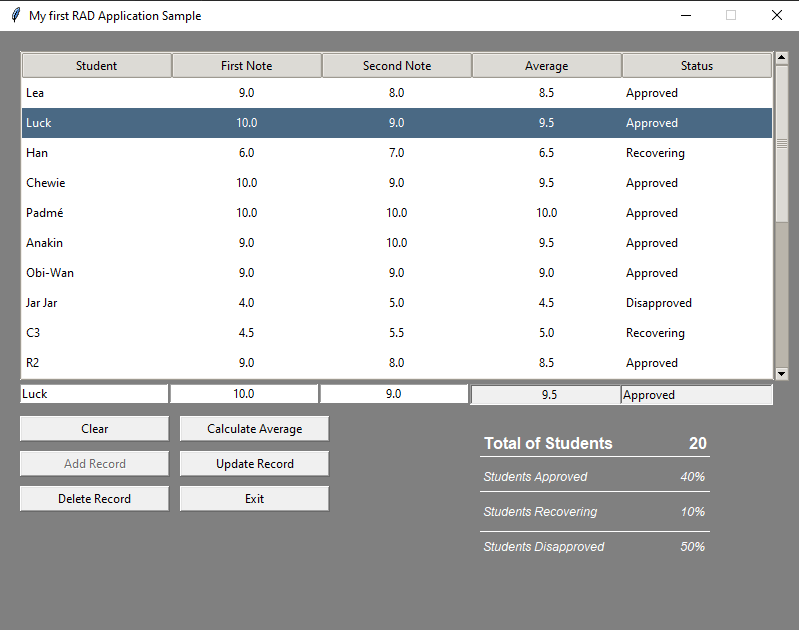

# My First RAD Project

  
**_My implementations_**  
> _TTK Style for Treeview_  
_Clear fields, Add, Update and Delete Record and Exit Buttons_
_Disable / Enable Buttons_  
_Statistics Painel_  
_MessageBox for exeptions and exit_  

* Python Library
  * https://docs.python.org/3/library/

* Tkinter Library
  * https://docs.python.org/3/library/tkinter.html

* Pandas Library
  * https://pandas.pydata.org/docs/reference/index.html
